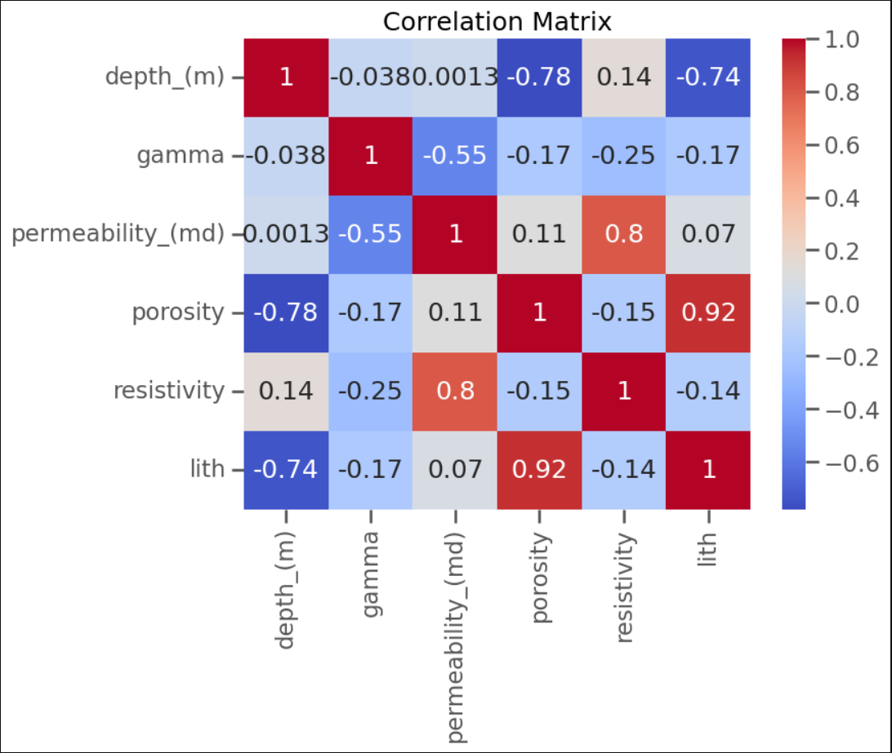
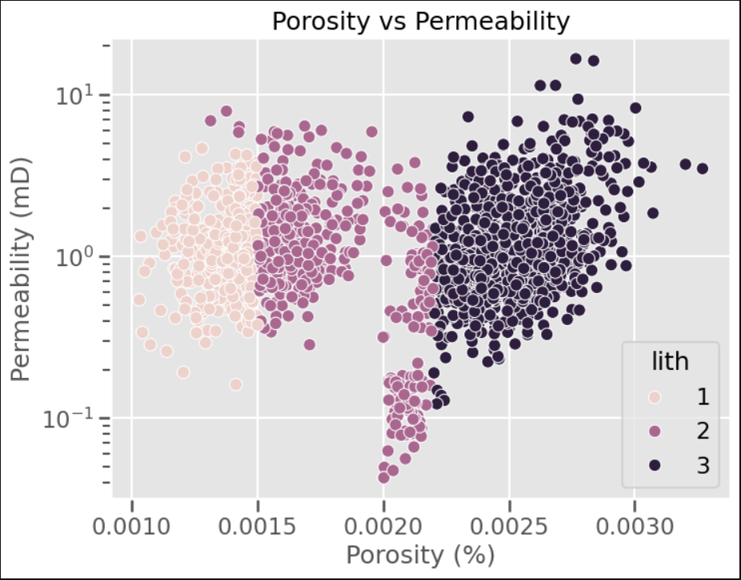
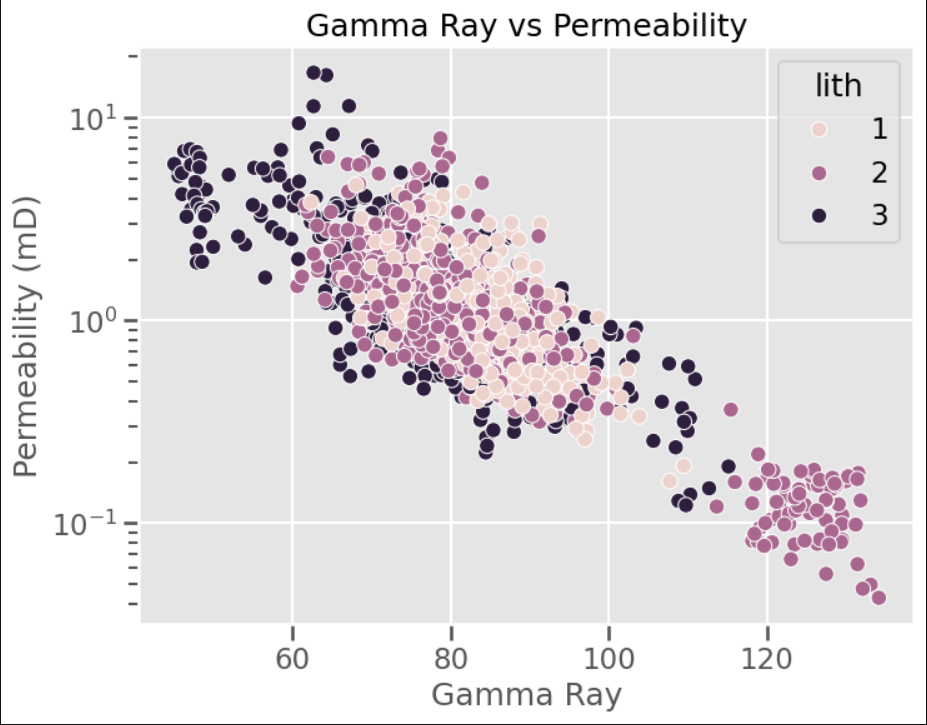

# Porosity–Permeability and Lithology-Based Reservoir Characterization

## Overview

This project investigates reservoir quality relationships using public petrophysical data. The analysis focuses on the interaction between porosity, permeability, lithology, gamma-ray response, resistivity, and depth to evaluate reservoir behavior and flow characteristics.

The project was developed using Python and Jupyter Notebook with an emphasis on combining data analysis workflows with practical reservoir interpretation.

---

## Objectives

- Analyze porosity–permeability relationships
- Investigate lithology influence on reservoir quality
- Evaluate gamma-ray impact on permeability
- Study depth-related compaction trends
- Classify reservoir quality intervals
- Develop engineering-focused interpretations using data analysis techniques

---

## Dataset

The dataset contains public petrophysical measurements including:

- Depth
- Gamma Ray
- Permeability
- Porosity
- Resistivity
- Lithology Classification

Source:
Public dataset obtained from Kaggle for educational and portfolio purposes.
https://www.kaggle.com/datasets/sahasourav17/well-logs
---

## Tools & Technologies

- Python
- Jupyter Notebook
- pandas
- numpy
- matplotlib
- seaborn

---

## Project Structure

```text
porosity-permeability-reservoir-characterization/
│
├── data/
│   ├── raw/
│   └── cleaned/
│
├── notebooks/
│   └── reservoir_characterization.ipynb
│
├── outputs/
│   └── figures/
```

---

## Exploratory Reservoir Analysis

The analysis investigates several key reservoir characterization relationships:

### Correlation Analysis
- Evaluated relationships between petrophysical variables
- Identified strong permeability–resistivity trends
- Observed depth-related porosity reduction

### Porosity vs Permeability
- Investigated reservoir flow behavior
- Evaluated heterogeneity effects
- Analyzed lithology-dependent clustering

### Gamma Ray Analysis
- Studied shale influence on reservoir quality
- Evaluated permeability reduction trends with increasing gamma-ray response

### Lithology-Based Characterization
- Compared permeability distributions between lithological groups
- Investigated heterogeneity variations

### Reservoir Quality Classification
Reservoir intervals were classified into:
- High Quality
- Moderate Quality
- Tight Reservoir

---

## Key Findings

- Permeability exhibits strong variability at similar porosity values, indicating heterogeneity and varying pore connectivity.
- Higher gamma-ray intervals generally correspond to lower permeability trends, consistent with shale influence.
- Depth shows a negative relationship with porosity, suggesting compaction-related effects.
- Lithology significantly impacts permeability distribution and reservoir quality behavior.

---

## Example Visualizations

### Correlation Matrix



---

### Porosity vs Permeability



---

### Gamma Ray vs Permeability



---

## Future Improvements

Potential future enhancements include:

- Incorporating capillary pressure data
- Adding clustering-based rock typing
- Developing interactive dashboards
- Expanding petrophysical interpretation workflows
- Applying machine learning-based reservoir classification

---

## Conclusion

This project demonstrates how public petrophysical datasets can be used to investigate reservoir quality, flow behavior, and lithology-dependent reservoir characteristics using data-driven analytical workflows.

The work combines reservoir engineering interpretation with practical data analysis techniques using Python.
